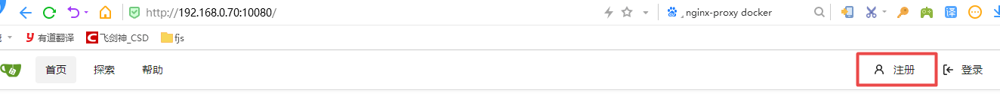
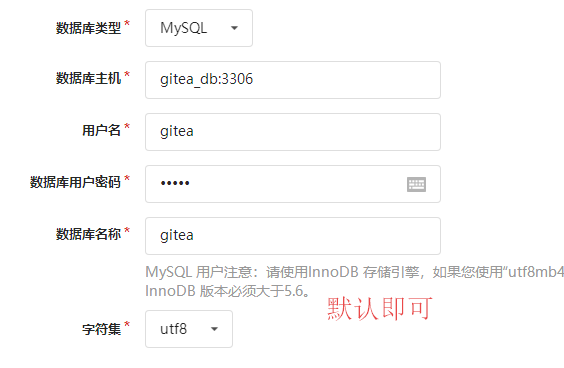
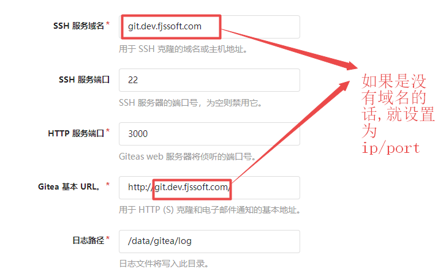
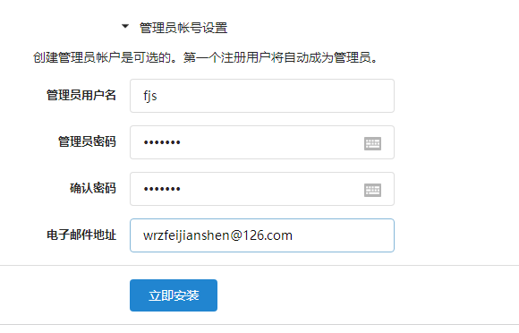
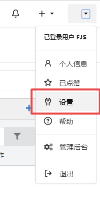
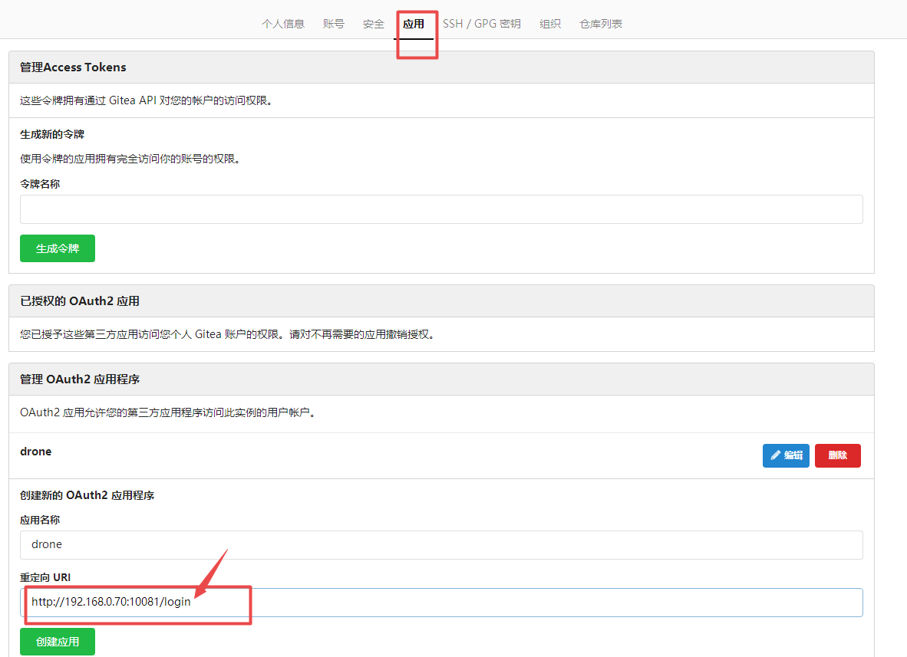
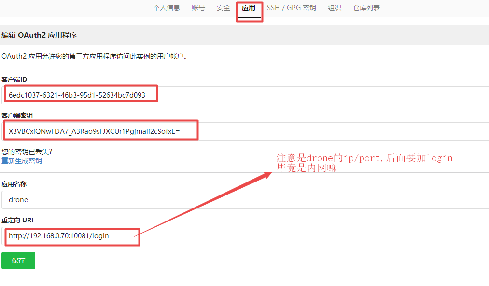
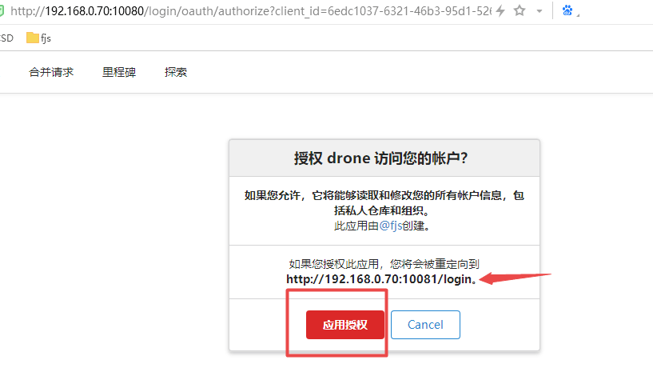
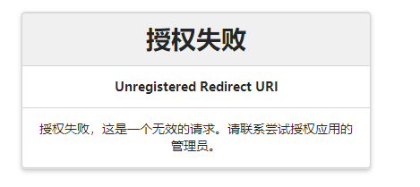
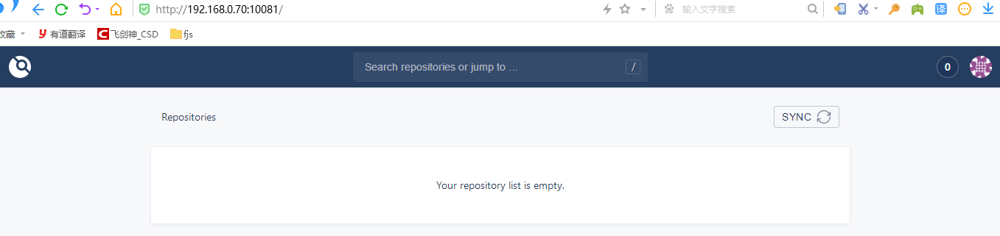

### drone 1.0 安装入门搭建教程

由于 1.0 的更新换代之后,增加了OAuth2支持性更好了, 对github,gitlab,gitea已经非常的友好了,而之前的博客是gogs的,所以今天单独来写一篇关于gitea的,gitlab应该也是类似的.

#### 步骤1: 创建网络,开启反向代理

虽然不知道运维大大们是怎么玩的,作为小小白的开发者,只关心怎么弄出来就可以了,怎么好看怎么玩是他们的事情咯

咱们把这gitea和drone划分到一个网络里,所有的带#的,就默认在linux 终端执行的命令.

```
ip/port 划分
gitea : 192.168.0.70/10080
drone : 192.168.0.70/10081

创建网络: nginx_net
# docker network create nginx_net

```

开启反向代理, 请看下一篇文章,不需要则不用设置,简单说说,反向代理,在同局域网另一个ip设置好hosts 域名指向ip后,访问域名会自动跳转到相应的网站.


#### 开启gitea

docker-compose.yml 

```
version: "3"
networks:
  nginx_net:
    external: true

services:
  gitea_server:
    image: gitea/gitea:latest
    container_name: gitea
    restart: always
    networks:
      - nginx_net
    volumes:
      - ./data/gitea:/data
    ports:
      - "10080:3000"
      - "222:22"
    depends_on:
      - gitea_db
    environment:
      - USER_UID=1000
      - USER_GID=1000
      - DB_TYPE=mysql
      - DB_HOST=gitea_db:3306
      - DB_NAME=gitea
      - DB_USER=gitea
      - DB_PASSWD=gitea
      # nginx_proxy 的反向代理,不用则不用设置
      - VIRTUAL_HOST=git.dev.fjssoft.com
      - VIRTUAL_PORT=3000

  gitea_db:
    image: mysql:8
    restart: always
    container_name: gitea_db
    environment:
      - MYSQL_ROOT_PASSWORD=gitea
      - MYSQL_USER=gitea
      - MYSQL_PASSWORD=gitea
      - MYSQL_DATABASE=gitea
    networks:
      - nginx_net
    volumes:
      - ./data/mysql:/var/lib/mysql
```
```
# docker-compose up -d
```

点击注册









设置 OAuth2 应用,来供drone使用







```
客户端ID : DRONE_GITEA_CLIENT_ID
6edc1037-6321-46b3-95d1-52634bc7d093
客户端密钥 : DRONE_GITEA_CLIENT_SECRET
X3VBCxiQNwFDA7_A3Rao9sFJXCUr1Pgjmali2cSofxE=

```

注意先有oauth2 才会去创建drone容器,因为需要配置id和秘钥.复制一下这两个值后,点击保存. 替换 server.env 中的 DRONE_GITEA_CLIENT_ID, DRONE_GITEA_CLIENT_SECRET

#### 启动 drone

docker-compose.yml 

```
version: '3.7'

networks:
  nginx_net:
    external: true

services:
  drone-server:
    image: drone/drone:latest
    container_name: drone
    ports:
      - 10081:80
    volumes:
      - ./data/drone:/var/lib/drone/
      - /var/run/docker.sock:/var/run/docker.sock
    restart: always
    networks:
      - nginx_net
    env_file:
      # 环境变量都放到一个文件里面
      - ./config/server.env
  drone-runner:
    image: drone/drone-runner-docker:latest
    depends_on:
      - drone-server
    volumes:
      - /var/run/docker.sock:/var/run/docker.sock
    restart: always
    networks:
      - nginx_net
    env_file:
      - ./config/runner.env
```

创建通信秘钥,复制一下,替换runner.env,server.env 中的 DRONE_RPC_SECRET
```
# openssl rand -hex 16
4f3b7f51e3dd678c08cf2d0675c66760
```

创建环境变量的文件 config/server.env
```
# openssl rand -hex 16 
# 和 runner 通信的秘钥
DRONE_RPC_SECRET=d5bc8623653264aa1bc16f983aaf2d60

# 设置本机的host地址,这里一定不要加http://
DRONE_SERVER_HOST=192.168.0.70:10081
DRONE_SERVER_PROTO=http

# gitea地址
# 如果是github,官网查看 https://docs.drone.io/server/reference/
# 标识 DRONE_GITHUB_CLIENT_ID
DRONE_GITEA_SERVER=http://192.168.0.70:10080

# 设置(而不是管理后台哦)-->应用
DRONE_GITEA_CLIENT_ID=6edc1037-6321-46b3-95d1-52634bc7d093
DRONE_GITEA_CLIENT_SECRET=X3VBCxiQNwFDA7_A3Rao9sFJXCUr1Pgjmali2cSofxE=

DRONE_DEBUG=true

TZ=Asia/Shanghai
# nginx_proxy 反向代理的端口和域名地址,仅供外部主机访问,不能用于容器内部
VIRTUAL_PORT=80
VIRTUAL_HOST=drone.dev.fjssoft.com
```
创建配置文件 runner.env

```
# openssl rand -hex 16 
# 和 server 通信的秘钥
DRONE_RPC_SECRET=d5bc8623653264aa1bc16f983aaf2d60

# server 的ip/端口,要写ip/port
DRONE_RPC_HOST=192.168.0.70:10081

# 显示终端日志
DRONE_LOGS_TRACE=true
DRONE_LOGS_DEBUG=true

# server 的ip/端口,要写ip/port
DRONE_SERVER_PROXY_HOST=192.168.0.70:10081
DRONE_SERVER_PROXY_PROTO=http
```

```
# docker-compose up -d

```

http://192.168.0.70:10081/




##### 错误 --> 
```
错误1:
Login Failed. unauthorized_client: client is not authorized

说明 DRONE_GITEA_CLIENT_ID 和 DRONE_GITEA_CLIENT_SECRET
不匹配 gitea中的值


```

错误2: Unregistered Redirect URI

```
http://192.168.0.70:10080/login/oauth/authorize?client_id=6edc1037-6321-46b3-95d1-52634bc7d093&redirect_uri=http%3A%2F%2Fhttp%3A%2F%2F192.168.0.70%3A10081%2Flogin&response_type=code&state=4d65822107fcfd52
```
从上面的url地址来看 redirect_uri=http%3A%2F%2Fhttp%3A%2F%2F,多出现了http:// 

why????

在github.com/drone的提的问题中,也是很隐蔽的,没有答案.其实直接从url去掉就可以了.

其中这个redirect_uri 就是回调到drone的地址, 

在server.env中如果是写成http://,则出现这个情况.
DRONE_SERVER_HOST=http://192.168.0.70:10081

所以不需要加http:// ,直接DRONE_SERVER_HOST=192.168.0.70:10081

除了这个,就要和 gitea中的 重定向url http://192.168.0.70:10081/login , 一定是要匹配的,否则你会疯掉的.




### 示例

已经安装完毕后



在gitea中创建一个项目

