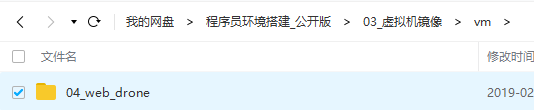
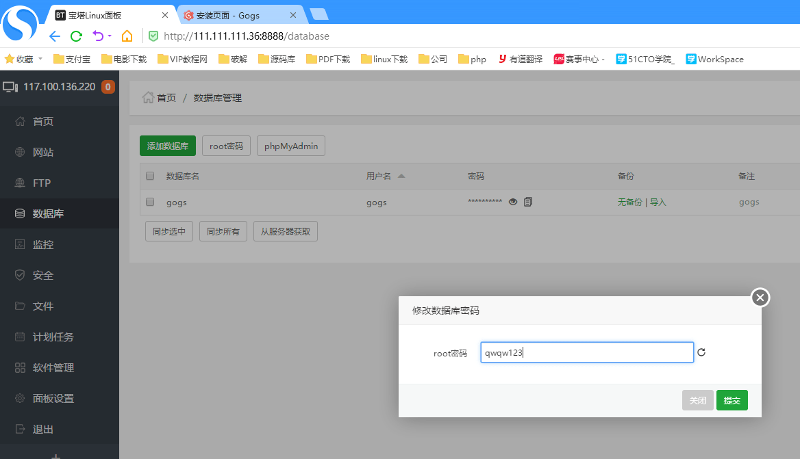
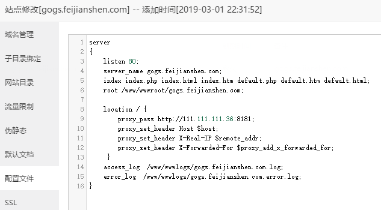
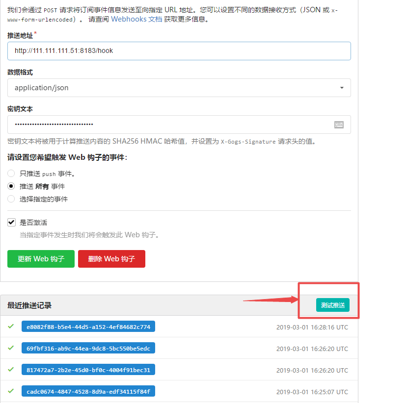

## drone 的学习之路

## drone 简介

drone是基于docker技术的CI/CD系统,Drone将编译/测试的流程都在docker容器内进行.开发者需要在项目中包含.drone.yml文件,将代码推送到git仓库,drone就能够自动化的进行编译/测试/发布.

drone 属于DevOps工具,开发/测试/部署,devops有Jenkins/Drone/Gitlab CI/CD.

为什么不选择Jenkins,是因为开发Plugin,部署也不简单.也不选择用Gitlab CI,好像它只支持gitlab吧,也无法用plugin.

整个代码仓库及文档皆放在
https://github.com/wrzfeijianshen/drone_tutorial

md:文档;

workspace : 配置文件和需要的软件

code : 代码仓库

参考诸位大神博客: 
```
https://www.cntofu.com/book/139/cases/ci/drone.md
https://www.cnblogs.com/rongfengliang/p/9960792.html
官网: https://drone.io/
仓库 https://github.com/drone/drone.git
视频教程 http://edu.51cto.com/course/16131.html
```

dorne流程: 
```
1.git clone 
2.测试
3.打包
4.部署
5.发送信息
```
用yaml的管理方案流程,支持大部分的git host,比如gitlab,github.

drone的架构:一个主伺服器,多个代理服务器(agent).

drone的优势:
```
1.启动速度快
2.不需要管理员,ui界面容易操作
3.在本机端可以进行测试
4.完全基于容器开发的
5.任何语言都可以写Plugin
```

```
https://blog.drone.io/
https://docs.drone.io/
```
推荐
```
镜像仓库：harbor
制品库:nexus 做maven仓库,yum仓库放二进制文件等非常合适,强烈推荐
```
### 虚拟机操作

这里做个记录吧,省的以后来回翻腾.

```
总体规划:
1.操作系统采用centos 虚拟机;

采用centos部署web网站:
NAT网（111.111.111.3-111.111.111.254）
centos6.8（6.x/7.x）：111.111.111.3-60

部署ip:
111.111.111.34 : base 镜像
111.111.111.35 : web 4g
111.111.111.36 : git 服务器 gogs 4g 端口 8181
111.111.111.50 : drone0.8 8g 端口 8182
111.111.111.51 : drone1.0 8g 端口 8183

操作流程
1. 虚拟机:centos7 搭建搭建宝塔面板
2. 快照及保存镜像.
3. 复制一份虚拟机作为 web镜像 111.111.111.35 -->所有的网站等应用都可以放到这里
4. 安装docker/docker-compose
5. 快照
6. 复制一份,作为gogs服务器,docker部署gogs
7. 复制一份,作为drone0.8和drone1.0
```

web站点是作为各种应用,保存或备份网络云主机的你的站点内容的,一旦线上的网站 不能用了,网络访问慢了,还可以用本地.

gogs也是作为代码财富库的存在价值的,所以今早的有自己的代码库存在.

drone,可以实现各种ci/cd ,测试,打包等操作.方便你在各个平台进行编译的时间,

为什么不在同一台虚拟机同时跑gogs和drone.或者为什么不在docker中跑宝塔面板等.
原因是我觉得还是分开比较好,一台只干一台的活,尽量精简,在docker跑宝塔面板毕竟docker也很占用资源的.

gogs和drone这都属于docker下的.把gogs换成gitlab效果就不一样了,gitlab也是极其占用资源的.如果gitlab和drone一起跑,会更占用内存的.

毕竟你今后的私人的代码仓库,这个要作为代码财富库来进行管理的,不能够只是存在本地的,打个压缩包就扔那里了,gogs占用资源也少.

drone有时候会清理磁盘什么的,升级什么的,添加新的docker镜像什么的.一旦出错,就会影响到gogs这部分运行的.


复制镜像时:
注意一点,如果有其余的虚拟机存在,请挂起后,再进行修改本地ip,避免一台虚拟机正在运行,而你将要启动的虚拟机与这台虚拟机ip相同.
你修改的ip则无效.访问不了网络.


### 安装虚拟机 

具体安装步骤可参考 https://blog.csdn.net/wrzfeijianshen/article/category/6520463/2?

里面也有NAT网络如何配置的

安装镜像为: CentOS-7-x86_64-Minimal-1810.iso

1.新建文件夹 D:\vm\TL_Web\centos7_1810

2.新建虚拟机
连接名称为ens33
配置静态网络:
111.111.111.34 255.255.255.0 111.111.111.2  dns 111.111.111.2 8.8.8.8
root 密码:qwqw123
用户 fjs 密码: qwqw123

```
因为centos7已经不使用 ifconfig命令了,已经用ip命令代替,ip addr 即查看分配网卡情况.
sudo yum install -y wget 

mv /etc/yum.repos.d/CentOS-Base.repo /etc/yum.repos.d/CentOS-Base.repo.backup
wget -O /etc/yum.repos.d/CentOS-Base.repo http://mirrors.aliyun.com/repo/Centos-7.repo
yum clean all
yum makecache
//wget -P /etc/yum.repos.d/ http://mirrors.aliyun.com/repo/epel-7.repo 
sudo yum -y update && yum -y upgrade

yum install -y vim net-tools gcc gcc-c++ openssh-server vsftpd lftp tree lrzsz binutils compat-libstdc+±33 elfutils-libelf  elfutils-libelf-devel-static glibc glibc-common glibc-devel glibc-headers glibc-static kernel-headers pdksh libaio-devel libaio libgcc libgomp libstdc++ libstdc+±devel make sysstat numactl-devel 

安装过程中遇见vim 不能够使用问题 -->但是这种情况,请重新装系统吧,否则其余软件也是这种情况滴.
现象是输入vim回车,什么也没有反应,后来卸载yum remove -y vim,再安装,输入vim后就提示下面错误了

vim: error while loading shared libraries: /lib64/libgpm.so.2: file too short
yum provides *libgpm.so.2
yum reinstall -y gpm-libs

vim: error while loading shared libraries: /usr/lib64/perl5/CORE/libperl.so: file too short
yum reinstall -y perl-libs
yum install gpm gpm-devel -y

yum remove -y vim*
yum install -y vim*
```

快照此base镜像:
我会放到百度云:


  

3.安装宝塔面板

主要是方便快捷,再安装nginx和数据库即可.如果不需要数据库则关闭卸载即可.


```
vi  /etc/sysconfig/network-scripts/ifcfg-ens33  ip修改为35 作为web站点
重启
mkdir -p /www/deb
cd /www/deb
yum install -y wget && wget -O install.sh http://download.bt.cn/install/install_6.0.sh && bash install.sh
输入y

rm -f /www/server/panel/data/domain.conf

http://111.111.111.35:8888/

用户:fjs
密码:qwqw123123
进行快照即可
剩下的虚拟机,皆用这个.关闭后压缩.

安装docker
vi  /etc/sysconfig/network-scripts/ifcfg-ens33  ip修改为36
重启

1.Docker 要求 CentOS 系统的内核版本高于 3.10 ，查看本页面的前提条件来验证你的CentOS 版本是否支持 Docker 。
通过 uname -r 命令查看你当前的内核版本
uname -r
2.使用 root 权限登录 Centos。确保 yum 包更新到最新。
sudo yum update
3.卸载旧版本(如果安装过旧版本的话)
sudo yum remove docker docker-common docker-selinux docker-engine
4.安装需要的软件包， yum-util 提供yum-config-manager功能，另外两个是devicemapper驱动依赖的
sudo yum install -y yum-utils device-mapper-persistent-data lvm2
5.设置yum源
sudo yum-config-manager --add-repo https://download.docker.com/linux/centos/docker-ce.repo
6.可以查看所有仓库中所有docker版本，并选择特定版本安装
yum list docker-ce --showduplicates | sort -r
7.安装docker

$ sudo yum install -y docker-ce  #由于repo中默认只开启stable仓库，故这里安装的是最新稳定版17.12.0
$ sudo yum install <FQPN>  # 例如：sudo yum install docker-ce-17.12.0.ce

8.启动并加入开机启动

sudo systemctl start docker
sudo systemctl enable docker

sudo mkdir -p /etc/docker
Docker 官方中国区
https://registry.docker-cn.com
网易
http://hub-mirror.c.163.com
ustc
https://docker.mirrors.ustc.edu.cn
咱们采用阿里云官方的提供的镜像
链接地址：https://cr.console.aliyun.com/#/accelerator
sudo mkdir -p /etc/docker
sudo tee /etc/docker/daemon.json <<-'EOF'
{
  "registry-mirrors": ["https://xxxx.mirror.aliyuncs.com"]
}
EOF
sudo systemctl daemon-reload
sudo systemctl restart docker

安装docker-compose
sudo pip install -U docker-compose

docker-compose up/down/stop -d

进行快照,如此便可以采用docker进行一统天下了.


```

### 部署gogs

采用本地gogs作为git工具.像gitlab和github等,拉取网速慢呀.部署环境复杂,占内存等等.故不采用了.网上教程也有很多的.如何部署后,在drone使用.

修改本地ip 111.111.111.36

添加数据库




```
上传 /www/docker/gogs/docker-compose.yml 
mkdir -p /www/docker
上传后
docker-compose up -d 

```

```
version: '3'

services:
  gogs:
    image: gogs/gogs:latest
    ports:
      - "10022:22"
      - 8181:3000
    volumes:
      - ./data/gogs/data:/data
    restart: always
```


添加


可以部署本地域名或用ip+端口(111.111.111.36:8181)的进行访问方式。



```
server
{
    listen 80;
    server_name gogs.feijianshen.com;
    index index.php index.html index.htm default.php default.htm default.html;
    root /www/wwwroot/gogs.feijianshen.com;
    
    location / {
   		proxy_pass http://111.111.111.36:8181;
    	proxy_set_header Host $host;
		proxy_set_header X-Real-IP $remote_addr;
		proxy_set_header X-Forwarded-For $proxy_add_x_forwarded_for;
 	 }
    access_log  /www/wwwlogs/gogs.feijianshen.com.log;
    error_log  /www/wwwlogs/gogs.feijianshen.com.error.log;
}
```
修改本地hosts文件


虚拟机进行快照.已经配置好gogs了

要定期的快照,因为是代码库价值的体现.

### 安装drone

```
https://docs.drone.io/
https://docs.drone.io/installation/gogs/
https://0-8-0.docs.drone.io/install-for-gogs/
```

因为咱们是选择的是纯虚拟机单独跑,属于小团队,只需要一台就可以了.单机跑就足够了. 当然github等也都需要配置的.其他仓库相对繁琐一些,配置项也有很多的.很多网上都有例子存在.
```
https://docs.drone.io/installation/gogs/single-machine/
```

因为在docker仓库中,0.8 和0.8.9版本应该是一样的
https://hub.docker.com/r/drone/drone
故 0.8版本采用 image: drone/drone:0.8
1.0 版本采用 drone/drone:1.0.0-rc.5 镜像

#### 安装drone 0.8
复制虚拟机后,先挂起其他的虚拟机.

修改ip : 111.111.111.50 和111.111.111.51

修改配置文件后,放行8182端口


```
version: "3"
services:
  drone-server:
    container_name: drone_server
    image: drone/drone:0.8
    ports:
      - 8182:8000
      - 9000
    volumes:
      - ./data/drone:/var/lib/drone/
    environment:
      # 开启注册，此配置允许任何人自注册和登录系统
      - DRONE_OPEN=true
      #直接配置ip:port 会报错
      - DRONE_HOST=http://111.111.111.50:8182
      # Gogs服务器地址
      - DRONE_GOGS_URL=http://111.111.111.36:8181
      - DRONE_DEBUG=true
      # 此SECRET为任意值
      - DRONE_SECRET=drone.feijianshen.com
      # 开启Gogs驱动
      - DRONE_GOGS=true
      - DRONE_GOGS_SKIP_VERIFY=false
      - DRONE_GOGS_PRIVATE_MODE=true
    restart: always

  drone-agent:
    container_name: drone_agent
    image: drone/agent:0.8
    depends_on:
      - drone-server
    volumes:
      - /var/run/docker.sock:/var/run/docker.sock
    environment:
      # Drone Server 地址
      - DRONE_SERVER=drone-server:9000
      # 与Drone Server一致即可
      - DRONE_SECRET=drone.feijianshen.com
      - DRONE_DEBUG=true
    restart: always
```
docker-compose up -d

登录gogs的账号密码


这就搭建完成了.
#### 安装drone 1.0
修改ip 111.111.111.51后,放行8183端口

https://hub.docker.com/r/drone/agent/tags
https://hub.docker.com/r/drone/agent/tags

建议还是固定tag号,不建议最新.


```
version: '3'
services:
  drone-server:
    image: drone/drone:1.0.0-rc.5
    ports:
      - "8183:80"
    volumes:
      - ./data/drone:/var/lib/drone/
      - /var/run/docker.sock:/var/run/docker.sock
    environment:
      - DRONE_OPEN=true
      - DRONE_SERVER_HOST=drone-server
      - DRONE_DEBUG=true
      - DRONE_GIT_ALWAYS_AUTH=false
      - DRONE_GOGS=true
      - DRONE_GOGS_SKIP_VERIFY=false
      - DRONE_GOGS_SERVER=http://111.111.111.36:8181
      - DRONE_PROVIDER=gogs
      - DRONE_DATABASE_DATASOURCE=/var/lib/drone/drone.sqlite
      - DRONE_DATABASE_DRIVER=sqlite3
      - DRONE_SERVER_PROTO=http
      - DRONE_RPC_SECRET=ALQU2M0KdptXUdTPKcEw
   
  drone-agent:
    image: drone/agent:1.0.0-rc.5
    volumes:
      - /var/run/docker.sock:/var/run/docker.sock
    depends_on:
      - drone-server
    environment:
      - DRONE_RPC_SERVER=http://drone-server
      - DRONE_RPC_SECRET=ALQU2M0KdptXUdTPKcEw
      - DRONE_DEBUG=true
```
docker-compose up -d

登录gogs的账号密码


这就搭建完成了.

### 测试
在gogs创建一个drone_example项目


在drone0.8 里刷新


点击激活


把整个复制进去即可.


F5刷新后,点击激活


```
基本钩子都是如下,ip/hook即可.

http://111.111.111.51:8183/hook
或者
http://drone-server/hook
如下截图:
```


这里会成对号,如果是测试不成功,说明钩子不能够生效,



当然了,一般是不会直接能够钩子可以成功的.
简单操作如下.
把你的ip
http://111.111.111.51:8183 或
http://drone-server

比如:先用http://drone-server 测试


碰见这种情况,1970年,刷新就行了,
再次点击 测试推送几次之后,


这个状态代码钩子不能够使用.
输入推送地址 http://111.111.111.51:8183 保存之后

多推送几次之后,就会发现.

这个状态是ok

0.8.drone.yml 文件内容
```
workspace:
  base: /drone_test
  path: drone_test/drone_0.8_example

clone:
  git:
    image: plugins/git
    depath: 50
    tags: true
    
pipeline:
  node:
    image: golang
    commands:
      - go version
```

在drone1.0里面测试
```
kind: pipeline
name: default
steps:
- name: info
  image: busybox
  commands:
    - echo "appdemo"
```
咱们0.8的基本没有问题,1.0的确实有些问题,咱们把这个1.0yml提交了上去.

在gogs钩子上,咱们再次点击测试推送,也是可以的.咱们把推送地址修改为 http://111.111.111.51:8183/hook

更新钩子之后,再点击测试推送之后,在111.111.111.51:8183中 drone1.0里面就能够发现已经成功了.


当如果没有及时的drone更新,在gogs中点击测试推送,一些钩子就会过去的,有些需要下载docker images镜像.故时间会长一些,当下载完,下一次推送就会很快了.

### 使用教程

#### 后台页面
这里是显示正在运行的项目


workspace